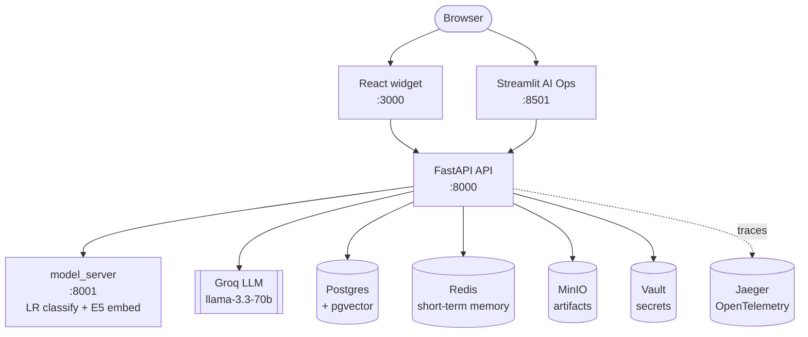
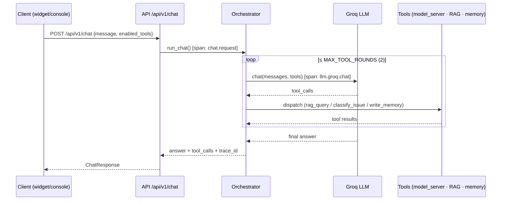
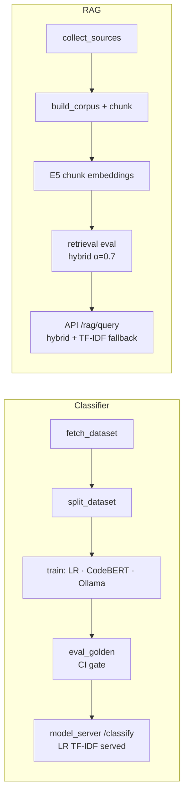

# Handyman — Maintainer's Copilot

> An AI copilot for open-source maintainers: it triages a GitHub issue (classify → retrieve → answer), remembers maintainer preferences, and ships as an embeddable chat widget — all behind one FastAPI backend, fully containerized with observability and CI eval gates.


-0A9EDC?logo=pytest&logoColor=white)
<!-- Add the live CI badge once the repo is on GitHub:
 -->

---

## The problem it solves

Open-source maintainers drown in repetitive issue triage: *what kind of issue is this, has it been answered before, what do the docs say?* **Handyman** automates that first pass. Given an issue, it classifies the type, retrieves the most relevant docs/issues via hybrid RAG, answers with a hosted LLM that calls tools, and persists what it learns about each maintainer — exposed both as an internal ops console and a drop-in website chat widget.

## Demo

| Internal AI Ops console (Streamlit) | Embeddable widget (React) |
|---|---|
|  _(screenshot placeholder)_ |  _(screenshot placeholder)_ |

> Drop images into `screenshots/` to replace the placeholders. `docker compose up --build` then open http://localhost:8501 (console) and http://localhost:8080 (widget demo).

## Architecture

One FastAPI backend fronts every capability; two browser surfaces (internal Streamlit console + embeddable React widget) and a separate CPU inference service talk to it. Torch lives **only** in `model_server` — the API image is GPU-free by design (enforced in CI).



## Tech stack

| Layer | Choices |
|---|---|
| **API** | FastAPI · Pydantic v2 · SQLAlchemy (async) + asyncpg · Alembic |
| **Data** | PostgreSQL + pgvector · Redis · MinIO (S3-compatible) |
| **Inference** | scikit-learn (LR TF-IDF, served) · Transformers E5 embeddings (served) · CodeBERT (best by eval) · Groq llama-3.3-70b (chat) · Ollama (baseline) |
| **Secrets / Observability** | HashiCorp Vault · OpenTelemetry → Jaeger · structlog (auto-redacted) |
| **Frontends** | Streamlit (internal ops) · React + TypeScript + Vite (embeddable widget) |
| **Tooling** | `uv` · `ruff` · `pytest` (5 marker layers) · Docker Compose · GitHub Actions |

## Features

- **Tool-calling chat** — Groq LLM orchestrates `rag_query`, `classify_issue`, `write_memory`, `summarize`, `extract_entities` (≤2 tool rounds), returning structured tool-call records.
- **Issue classifier** — bug / feature / docs / question. LR TF-IDF served (GPU-free, CI-safe); CodeBERT is best-by-eval; Ollama llama3 is the zero-shot baseline.
- **Hybrid RAG** — dense E5 (served via `model_server /embed`) + sparse TF-IDF at α=0.7, with reranking; transparently falls back to TF-IDF and always reports `retriever_used`.
- **Memory** — short-term in Redis (24h TTL), long-term episodic in Postgres.
- **Embeddable widget** — a `/widget.js` loader drops a React chat bubble onto any site via a generated `<script>` snippet; origins are CORS/CSP-gated.
- **Auth** — register/login with JWT; PBKDF2-SHA256 (260k iters) + constant-time comparison, stdlib-only.
- **Production-grade ops** — Vault-backed secrets with prod hardening, automatic secret redaction in logs, per-request distributed traces.

## Quickstart

```bash
cp .env.example .env
docker compose up --build          # brings up all services in dependency order
```

Startup is automatic via `depends_on`: data services + Vault → `vault-init` seeds dev secrets → `migrate` runs `alembic upgrade head` → `api` + `model_server` → `chatbot`.

| Service | URL | Purpose |
|---|---|---|
| API | http://localhost:8000 | FastAPI — auth, chat, RAG, memory, widget |
| API docs | http://localhost:8000/docs | Interactive OpenAPI UI |
| Model server | http://localhost:8001 | LR TF-IDF `/classify` + E5 `/embed` (CPU) |
| Chatbot | http://localhost:8501 | Streamlit AI Ops console |
| Widget | http://localhost:3000 | React widget bundle (nginx) |
| Host demo | http://localhost:8080 | Demo page with the embedded widget |
| MinIO console | http://localhost:9001 | Artifact storage browser |
| Vault | http://localhost:8200 | Secrets (local dev mode) |
| Jaeger | http://localhost:16686 | Distributed traces |

**Live chat** needs a real Groq key in Vault (everything else works without it):

```bash
docker compose exec vault vault kv put secret/llm groq_api_key="gsk_your_real_key"
```

**Run the tests** (no Docker required):

```bash
uv run --extra dev --extra ml --extra chatbot pytest
```

## Chat request lifecycle

A single chat turn is one traced `chat.request` span wrapping a bounded tool-calling loop. The LLM may call tools, whose results are fed back for up to two rounds before the final answer.



## RAG & ML pipelines

Models and the retrieval corpus are built offline by reproducible pipelines; the runtime serves the GPU-free artifacts and gates quality in CI.



**Reported metrics** (regenerable via the pipelines; thresholds in `eval_thresholds.yaml`):

| Track | Metric | Value |
|---|---|---|
| Classifier — CodeBERT (best by eval) | macro-F1 | 0.7061 |
| Classifier — LR TF-IDF (served) | macro-F1 | 0.6938 |
| Classifier — Ollama llama3 (baseline) | macro-F1 | 0.5554 |
| RAG — E5 hybrid (served) | hit@5 / MRR@10 | 0.68 / 0.329 |
| RAG — TF-IDF (CI gate / fallback) | hit@5 | 0.40 |

## Project structure

```
app/              FastAPI backend (DDD layering)
  api/            routes + Pydantic schemas + middleware (thin HTTP adapters)
  core/           Vault-backed Settings, canonical paths
  domain/         entities + typed errors (no I/O)
  infra/          external clients: db, redis, groq, ollama, model_server,
                  minio, vault, security (PBKDF2/JWT), redaction, logging, tracing
  repositories/   generic typed BaseRepository + per-entity repos
  services/       business logic: chat orchestrator, rag, memory, tools, widgets
model_server/     2nd FastAPI service — LR classifier + E5 embeddings (CPU)
ml/               classifier training/eval (classical, CodeBERT, LLM baseline, EDA)
pipelines/        RAG corpus build/chunk/eval + classifier golden eval
chatbot/          Streamlit AI Ops console (pages/ package, api_client, components)
widget/           React + TypeScript + Vite embeddable chat widget
alembic/          database migrations (incl. pgvector)
tests/            413 tests across 5 marker layers (unit/smoke/integration/eval/build)
docker/           per-service Dockerfiles + nginx/vault config
.github/          CI pipeline
```

## CI & evaluation

GitHub Actions ([.github/workflows/ci.yml](.github/workflows/ci.yml)) runs a 12-job pipeline on every push/PR:

- **Asset gate** → fails fast with per-file messages before eval jobs run.
- **Lint** (ruff) + a hard *"torch must be absent from the API image"* assertion.
- **Layered tests** — `unit`, `smoke`, `integration`, `eval`, `build` (pytest markers).
- **Golden evals** — classifier + RAG, with thresholds in `eval_thresholds.yaml` and uploaded reports.
- **Widget build** (npm) + **`docker compose config`** validation.

The test suite is dependency-free (fake repositories + mocked infra) — no Docker, network, or secrets needed to run it.

## Engineering notes worth a look

- **Strict DDD layering** — routes are thin adapters ("no business logic here"); every external client wraps failures into a typed domain error with graceful degradation (e.g. short-term memory returns `[]` when Redis is down).
- **Secret hygiene** — secrets resolved from Vault at boot, prod mode refuses dev tokens/placeholder keys, and a structlog processor auto-redacts API keys / PATs / JWTs / PEM blocks from every log line.
- **Honest evals** — deployed-vs-best is documented, not hidden: CodeBERT wins on macro-F1 but needs GPU, so LR TF-IDF is served (−0.012 macro-F1) for a GPU-free, CI-safe demo; generation quality uses a labeled deterministic proxy, not a fabricated LLM-judge score.

## Key documents

| Document | Purpose |
|---|---|
| [RUNBOOK.md](RUNBOOK.md) | Local and production deployment |
| [ARCH.md](ARCH.md) | System architecture |
| [DECISIONS.md](DECISIONS.md) | Locked technical decisions with numbers |
| [EVALS.md](EVALS.md) | CI eval gates and thresholds |
| [SECURITY.md](SECURITY.md) | Secret management and redaction policy |
